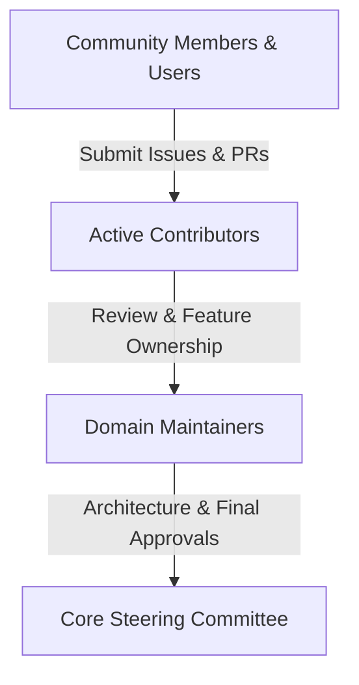

# Project Governance

This document outlines the governance model, leadership structure, decision-making processes, and maintainer responsibilities for the **Dayflow HRMS** project.

---

## 1. Governance Principles

Dayflow HRMS is guided by the following core values:

- **Openness & Transparency**: Decisions, discussions, and roadmaps are conducted publicly on GitHub.
- **Security & Reliability First**: Production data integrity and zero-trust security take precedence over rapid feature additions.
- **Modularity & Clean Architecture**: Code contributions must respect domain boundaries and established architectural conventions.
- **Inclusivity & Constructive Collaboration**: We welcome contributors from all backgrounds and experience levels.

---

## 2. Roles & Responsibilities

### Community Members
Users who deploy Dayflow, ask questions, file bug reports, participate in discussions, and propose feature requests.

### Contributors
Developers who submit pull requests, improve documentation, write unit/integration tests, or triage community issues.

### Maintainers
Trusted engineers with write access to the repository. Responsibilities include:
- Reviewing and merging pull requests.
- Triaging issues and bug reports.
- Ensuring code adheres to TypeScript strictness, domain separation, and testing standards.
- Mentoring new contributors.

### Core Steering Committee
The foundational group responsible for strategic vision, major architectural transitions, security vulnerability responses, and governance updates.

---

## 3. Decision-Making Process

### A. Lazy Consensus
For routine tasks (bug fixes, small enhancements, documentation updates, dependency upgrades), maintainers operate by **Lazy Consensus**. If a PR is reviewed and approved by at least one maintainer with no objections raised within 48 hours, it may be merged.

### B. Request for Comments (RFC) Process
For significant changes (e.g. database schema overhauls, new domain feature modules, authentication architecture modifications, breaking API changes):
1. **Author an RFC**: Open a GitHub Discussion under the `RFC` category detailing the motivation, design spec, API schema, database impacts, and alternatives.
2. **Community Review**: The RFC is opened for discussion for a minimum of 7 days.
3. **Approval**: Consensus among Maintainers and sign-off by at least one Core Steering Committee member is required before implementation begins.

---

## 4. Conflict Resolution

In rare instances where consensus cannot be reached:
1. Maintainers and contributors will seek compromise through focused technical discussion.
2. If consensus remains unachieved, the **Core Steering Committee** will make the final determination with a written rationale documented on the corresponding issue or RFC.

---

## 5. Becoming a Maintainer

Active contributors who demonstrate sustained, high-quality contributions, deep understanding of the architecture, respectful communication, and diligent code reviews may be invited to join the Maintainers team upon nomination and approval by the Core Steering Committee.
