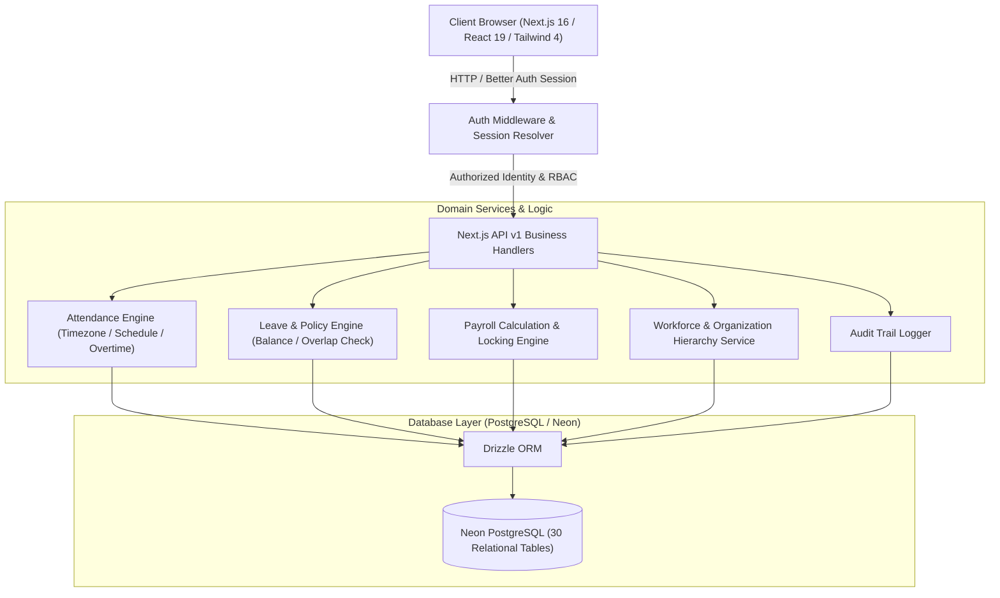

# Dayflow HRMS — Official Hackathon Presentation & Pitch Deck

> **"Every workday, perfectly aligned."**  
> A Next-generation, full-stack Human Resource Management System built for modern, agile, and hybrid enterprises.

---

## 📑 Table of Contents
1. [Slide Deck Outline (13 Slides)](#-slide-deck-outline)
2. [Word-for-Word Presenter's Speech Script](#-word-for-word-presenters-speech-script)
3. [Click-by-Click Live Demo Playbook](#-click-by-click-live-demo-playbook)
4. [Technical Architecture Deep Dive](#-technical-architecture-deep-dive)
5. [Anticipated Judge Q&A & Defenses](#-anticipated-judge-qa--defenses)

---

# 🖥️ Slide Deck Outline

```
┌────────────────────────────────────────────────────────────────────────────┐
│                                DAYFLOW HRMS                                │
│                     Every Workday, Perfectly Aligned                       │
│                                                                            │
│  [Slide 1]  Title & Vision Hook                                            │
│  [Slide 2]  The Problem: The Fragmented HR Crisis                          │
│  [Slide 3]  The Solution: Dayflow's Unified Architecture                   │
│  [Slide 4]  Modern Tech Stack & Engineering Rigor                          │
│  [Slide 5]  Multi-Tier Role-Based Access Control (RBAC)                    │
│  [Slide 6]  Feature 1: Interactive Dashboard & Server Punch Clock          │
│  [Slide 7]  Feature 2: Dynamic Leave & Time-Off Lifecycle                  │
│  [Slide 8]  Feature 3: Unified Approvals Queue                             │
│  [Slide 9]  Feature 4: Multi-Stage Payroll & Salary Engine                 │
│  [Slide 10] Feature 5: People 360° & Organizational Hierarchy              │
│  [Slide 11] Feature 6: Real-Time Analytics & Immutable Audit Security      │
│  [Slide 12] Competitive Advantage & Business Impact                        │
│  [Slide 13] Roadmap & Conclusion                                           │
└────────────────────────────────────────────────────────────────────────────┘
```

---

### Slide 1: Title & The Hook
* **Headline**: Dayflow HRMS — The Operating System for Modern Workforces
* **Sub-headline**: Consolidating attendance, leave, payroll, people operations, and compliance into a singular, high-performance web platform.
* **Key Visuals**: Product Hero Mockup showing Dark/Light UI, Live Workday Pulse widget, and Recharts analytics.
* **Speaker Focus**: Instant impact — Why the enterprise HR software landscape is ready for a modern rewrite.

---

### Slide 2: The Problem: The Fragmented HR Crisis
* **Key Pain Points**:
  1. **Disjointed Systems**: Attendance in biometric machines, leave requests in emails/Slack, payroll calculated in fragile spreadsheets, and employee data scattered across legacy tools.
  2. **Data Tampering & Inaccurate Clocks**: Client-side timestamp manipulation leading to attendance fraud and incorrect overtime disputes.
  3. **Manager Bottlenecks**: Multi-step, opaque approval chains that leave employees stranded without visibility into their leave balances or payslips.
  4. **Security & Compliance Vulnerabilities**: Lack of immutable audit trails, data leakage of confidential payroll numbers across unauthorized managerial tiers.

---

### Slide 3: The Solution: Dayflow's Unified Architecture
* **Core Philosophy**: A single source of truth for the entire employee lifecycle — from onboarding to daily operations and compensation.
* **Key Pillars**:
  - ⚡ **Real-Time Responsiveness**: Instant optimistic updates with TanStack Query and reactive Server Actions.
  - 🔒 **Zero-Trust Server Authoritative Security**: Server-derived timestamps, strict tenant isolation, and mathematical balance validation.
  - 👥 **Four Dedicated Role Personas**: Tailored workspaces for Employees, Managers, HR Operations, and System Administrators.
  - 📊 **Live Decision Intelligence**: Persisted real-time analytics with instant CSV compliance exports.

---

### Slide 4: Modern Tech Stack & Engineering Rigor
* **Frontend**: Next.js 16 (App Router), React 19, TypeScript, Tailwind CSS 4, shadcn/ui & Base UI.
* **State & Data Fetching**: TanStack React Query with centralized query key factories and automatic cache invalidation.
* **Backend & API**: Next.js Server Route Handlers (`/api/v1/*`) with standardized envelope formatting (`{ success: true, data, meta }`).
* **Authentication**: Better Auth 1.7 (HTTP-only secure cookies, GitHub OAuth, rate-limiting, CSRF mitigation, email verification).
* **Database & ORM**: Neon Serverless PostgreSQL + Drizzle ORM (30 relational tables with strict foreign keys, check constraints, and cascade policies).
* **Runtime & Tools**: Bun runtime, Zod runtime schema validators, Recharts, Lucide Icons, Sonner toasts.

---

### Slide 5: Multi-Tier Role-Based Access Control (RBAC)
* **The 4 Role Tiers**:
  1. 👤 **Employee**: Self-service profile, live punch clock, leave requests & balance tracking, attendance correction submission, payslip downloads, personal notifications.
  2. 👔 **Manager**: Direct reports roster (`/dashboard/my-team`), team attendance tracking, unified leave & attendance correction approvals, team availability signals. *Zero access to company-wide payroll.*
  3. 💼 **HR Operations**: Organization-wide employee onboarding drawer, leave policy configuration, manual attendance corrections, payroll period calculation & finalization, analytics, announcement broadcasts.
  4. 🛡️ **Administrator**: Full HR capabilities + Global organization settings, multi-office locations, work schedule shifts, company holiday calendar, role elevations, and immutable security audit logs.

---

### Slide 6: Feature Deep-Dive 1 — Interactive Dashboard & Server Attendance
* **Live Workday Pulse**:
  - One-click Check-In / Check-Out with live ticking duration counter.
  - Timezone-aware work date derivation (IANA timezone support).
  - Schedule-aware lateness detection and automatic break/overtime calculation.
* **Zero Client Clock Trust**: Server clock stamps check-ins; prevents retrospective manipulation.
* **Attendance Correction System**: Employees submit missed punches with justifications; managers review and approve in one click.
* **Multi-View Inspection**: Daily lists, weekly timelines, and status filtering (`present`, `half_day`, `absent`, `holiday`, `leave`).

---

### Slide 7: Feature Deep-Dive 2 — Dynamic Leave & Time-Off Lifecycle
* **Leave Catalog & Policy Engine**: Configurable leave categories (Paid Leave, Sick Leave, Casual Leave, Maternity/Paternity, Unpaid Leave).
* **Accurate Balance Tracking**: High-precision `numeric(7,2)` balance accounting preventing negative or over-allocated leaves.
* **Intelligent Request Form**:
  - Real-time date span validation with automated weekend/holiday deduction.
  - Overlap prevention algorithm (rejects conflicting date intervals).
  - Live status tracking (`pending`, `approved`, `rejected`, `cancelled`).

---

### Slide 8: Feature Deep-Dive 3 — Centralized Unified Approvals Hub
* **All-in-One Review Queue**:
  - Unified tabbed interface for Leave Requests and Attendance Corrections.
  - Direct employee context: requester name, department, date range, requested shift timings, reason notes.
* **One-Click Decision Flow**:
  - Instant **Approve** with optimistic UI updates.
  - **Reject** modal requiring justification comments to maintain audit integrity.
* **Hierarchy Enforcement**: Automatically routes requests to the designated reporting manager, preventing self-approvals.

---

### Slide 9: Feature Deep-Dive 4 — End-to-End Multi-Stage Payroll Engine
* **The 5-Stage Payroll Pipeline**:
  1. 📅 **Period Creation**: Define month/year salary cycle dates.
  2. 🧮 **Calculation Engine**: Automatically aggregates attendance, approved leaves, and salary structures to compute gross, allowances, deductions, PF, tax, and net salaries.
  3. 🔍 **Review & Adjustment**: HR audit of individual payslip line items.
  4. 🔒 **Period Finalization**: Immutable state locking preventing retro-modifications.
  5. 📢 **Publishing & Distribution**: Auto-generates downloadable payslips directly into employee self-service portals.
* **Privacy & Isolation**: Strict role isolation guarantees managers and employees only see their own payslips.

---

### Slide 10: Feature Deep-Dive 5 — People 360°, Onboarding & Organization Hierarchy
* **Rapid Onboarding Slide-Out Drawer**: HR adds employees in under 30 seconds with immediate credential generation.
* **Employee 360° Profile**:
  - Contact information, emergency contacts, residential addresses, and official document repository.
  - Organizational reporting hierarchy with recursive circular-dependency prevention.
* **Company Architecture Setup**:
  - Departments, Designations/Job Titles, Multi-Office Locations.
  - Shift Schedules: Start/end minutes, grace periods, break intervals, half-day cutoffs.
  - Company Holiday Calendar with countdown.

---

### Slide 11: Feature Deep-Dive 6 — Real-Time Analytics & Immutable Audit Trail
* **Interactive Executive Analytics**:
  - Visual charts (Recharts) covering Attendance Trends, Workforce Distribution, Leave Status Breakdowns, and Payroll Disbursements.
  - Instant One-Click CSV Export for audits and reporting.
* **Security & Audit Logs**:
  - Immutable event stream (`/dashboard/audit-logs`) capturing every sensitive action (role updates, payroll calculation, approvals, onboarding).
  - Captures Actor, Action, Description, Timestamp, and IP context.
* **In-App Notification Hub**: Real-time actionable alerts for request approvals, payslip releases, and corporate announcements.

---

### Slide 12: Competitive Advantage & Business Value
* 🚀 **Unmatched Performance**: Built on Next.js 16 + Bun, achieving sub-100ms API response times.
* 🛡️ **Enterprise-Grade Data Integrity**: Strict PostgreSQL database-level constraints guarantee zero orphan records or broken balances.
* 💡 **Zero Learning Curve**: Clean, modern, accessible UI crafted with shadcn/ui and Tailwind CSS 4.
* 💰 **Cost Efficiency**: Serverless PostgreSQL (Neon) and edge-ready architecture drastically lower cloud infrastructure costs compared to legacy bloated ERPs.

---

### Slide 13: Future Roadmap & Vision
* 🤖 **AI-Powered HR Copilot**: Natural language queries for HR policies, automated leave balance forecasts, and intelligent scheduling recommendations.
* 📱 **Mobile Native Companion**: Offline-capable PWA with geo-fenced mobile check-ins for field workers.
* 🔗 **Ecosystem Integrations**: Webhooks for Slack, Microsoft Teams, Google Calendar sync, and biometric hardware SDKs.
* 💬 **Call to Action / Q&A**: "Thank you! We invite your questions and would love to walk you through a live scenario."

---

# 🎙️ Word-for-Word Presenter's Speech Script

> **Presenter Note**:  
> *Target Duration: 7 to 10 Minutes.*  
> *Tone: Confident, energetic, technically articulate, and product-focused.*  
> *Visual Cues are marked in brackets `[LIKE THIS]`.*

---

### 🕒 [0:00 - 1:00] Act 1: The Hook & The Problem

`[SLIDE 1: Title & Vision Hook]`  
**"Good morning/afternoon, esteemed judges and fellow innovators.**

Every company, whether a twenty-person startup or a multinational enterprise, runs on one foundational element: **its people**. Yet, if you look at how human resources are managed today, the reality is painful. 

`[SLIDE 2: The Fragmented HR Crisis]`  
Companies juggle five different tools: a biometric machine for attendance, a Slack channel or email thread for leave requests, an error-prone spreadsheet for payroll, and a slow, legacy portal for employee records. 

When attendance doesn't sync with leave, payroll calculations break. When managers have to dig through emails to approve a day off, employees are left in limbo. And worst of all, client-side timestamps and loose database models create massive compliance and security risks.

`[SLIDE 3: Dayflow HRMS Unified Vision]`  
We built **Dayflow HRMS** to solve this once and for all. Dayflow is an all-in-one, modern Human Resource Management System engineered with one single promise: **Every workday, perfectly aligned.**

From the moment an employee checks in in the morning, to leave management, team oversight, automated multi-stage payroll, and enterprise audit compliance — Dayflow connects the entire organization into one seamless, reactive experience."

---

### 🕒 [1:00 - 2:30] Act 2: Architecture & Multi-Tier RBAC

`[SLIDE 4: Modern Tech Stack]`  
**"Let’s look under the hood.**

Dayflow is built on a cutting-edge, production-grade stack: **Next.js 16 with the App Router**, **React 19**, **TypeScript**, and **Tailwind CSS 4**. We use **Bun** for lightning-fast execution, **TanStack React Query** for optimistic state synchronization, and **Better Auth 1.7** for bulletproof session security and GitHub OAuth.

Our database layer is powered by **Drizzle ORM and Neon Serverless PostgreSQL**, featuring **30 relational tables** with strict foreign keys, check constraints, and cascade guarantees.

`[SLIDE 5: Multi-Tier RBAC]`  
Security and privacy are non-negotiable in HR. That’s why Dayflow enforces a strict **4-Tier Role-Based Access Control** model:

1. **The Employee**: Focuses on self-service — punching in, tracking leave balances, requesting corrections, and viewing payslips.
2. **The Manager**: Gains access to the **My Team** workspace to view direct reports, track team attendance in real-time, and approve leave requests without ever seeing organization-wide payroll.
3. **The HR Officer**: Manages the company roster, onboards employees, configures leave policies, and oversees payroll periods.
4. **The Administrator**: Has full governance over company-wide settings, office branches, shift timings, holiday calendars, and immutable security audit logs.

Every single request is authorized on the server side — no client-side role spoofing is ever possible."

---

### 🕒 [2:30 - 5:30] Act 3: Live Feature Walkthrough & Workflows

`[SLIDE 6: Interactive Dashboard & Attendance]`  
`[SWITCH TO LIVE DEMO SCREEN / BROWSER]`  
**"Let’s walk through what the daily experience feels like.**

When an employee logs into Dayflow, they are greeted by their personalized dashboard. Right at the top is our signature **Workday Pulse**. 

Watch this: with a single click on **Check In**, Dayflow records the punch. Notice that the timestamp is generated **strictly on our PostgreSQL server** using the organization's IANA timezone. An employee cannot manipulate their system clock to fake attendance. As I work, the live elapsed timer ticks in real time.

When the shift ends, clicking **Check Out** automatically calculates total duration, breaks, overtime, and determines whether the shift was a full day or half day.

If an employee forgets to clock out or experiences an internet drop, they don't have to panic. They open the **Attendance Corrections** modal, input the actual times and a reason, and submit it directly to their manager."

---

`[SLIDE 7: Dynamic Leave & Time-Off Lifecycle]`  
`[NAVIGATE TO TIME OFF PAGE]`  
**"Next, let’s look at Time Off.**

Traditional HR tools make tracking leave a math nightmare. In Dayflow, employees have real-time visibility into their allocated versus used balances for Paid, Sick, and Casual leave, tracked with exact `numeric(7,2)` precision.

When applying for leave, our form provides instant validation: it prevents overlapping requests, checks weekend and holiday schedules, and ensures the employee does not exceed their balance. Once submitted, the request moves to `pending` status."

---

`[SLIDE 8: Unified Approvals Queue]`  
`[NAVIGATE TO APPROVALS / SWITCH TO MANAGER VIEW]`  
**"Now let's switch hats to a Manager.**

Instead of hunting through email inboxes, managers have a single, unified **Approvals Hub**. Here, leave requests and attendance corrections appear in a clean, tabbed queue. 

The manager sees the employee's name, requested dates, department, and stated reason. With one click, they can **Approve** — which immediately deducts the balance and notifies the employee — or **Reject** with a mandatory reason for compliance."

---

`[SLIDE 9: Multi-Stage Payroll Engine]`  
`[NAVIGATE TO PAYROLL PAGE]`  
**"Now, let's talk about the crown jewel of HR operations: Payroll.**

Payroll errors destroy employee trust. Dayflow solves this with a **5-Stage Payroll Engine**:

1. First, HR creates a **Payroll Period** for the month.
2. Second, with one click on **Calculate**, our backend engine cross-references work schedules, attendance records, approved leaves, and salary structures to calculate gross salaries, deductions, taxes, and net pay.
3. Third, HR can audit and review every payslip item.
4. Fourth, HR clicks **Finalize Period**, which creates an immutable cryptographic lock on the period — preventing retroactive tampering.
5. Finally, HR clicks **Publish**, and payslips are instantly dispatched into each employee's self-service portal, ready for PDF download.

And remember: strict database isolation ensures managers and employees can only ever view their own payslips."

---

`[SLIDE 10: People Directory, 360° Profile & Organization]`  
`[NAVIGATE TO PEOPLE & ORGANIZATION PAGES]`  
**"Managing workforce growth is effortless.**

In the **People** directory, HR can onboard a new employee in seconds using our slide-out drawer. The **Employee 360° Profile** stores personal info, emergency contacts, addresses, documents, and manager assignments — complete with circular-reporting prevention.

Under **Organization**, administrators can easily configure Departments, Job Designations, Office Locations, Shift Work Schedules (with customizable grace periods and half-day thresholds), and the Company Holiday Calendar."

---

`[SLIDE 11: Analytics & Immutable Audit Logs]`  
`[NAVIGATE TO REPORTS & AUDIT LOGS]`  
**"Finally, let’s look at Executive Intelligence and Compliance.**

In the **Reports** tab, HR and leadership get real-time, interactive Recharts visualizations: attendance trends, workforce distribution, and payroll disbursement. If they need to report to executives or compliance auditors, a single click exports the data to CSV.

And for security, every critical action — from role promotions to payroll calculations — is permanently recorded in our **Audit Logs**, tracking the exact actor, action, timestamp, and network context."

---

### 🕒 [5:30 - 7:00] Act 4: Impact, Roadmap & Closing

`[SLIDE 12: Competitive Advantage & Business Impact]`  
**"To summarize what sets Dayflow apart:**

1. **True All-in-One Unification**: No third-party sync lags; attendance, leave, and payroll exist in one unified relational schema.
2. **Server-Authoritative Trust**: Zero client-side manipulation of clocks or balances.
3. **Enterprise UX**: Lightning-fast Next.js 16 App Router experience with instant feedback, skeleton loaders, and zero UI stutter.
4. **Security by Design**: 4-Tier RBAC, CSRF protection, rate limiting, and immutable audit logs.

`[SLIDE 13: Roadmap & Vision]`  
**Our vision for Dayflow is just beginning.**  
We are already working on an **AI HR Copilot** for conversational policy inquiries, a **Geo-fenced Mobile PWA** for field teams, and **Slack/Teams bot integrations**.

Dayflow isn’t just an HRMS. It is the operating system that gives organizations their time back, so they can focus on what truly matters — their people.

**Thank you so much! We would love to take your questions."**

---

# 🕹️ Click-by-Click Live Demo Playbook

Follow this exact sequence during your live presentation for maximum judge impact:

```
┌────────────────────────────────────────────────────────────────────────┐
│                        LIVE DEMO SEQUENCE                              │
├─────────┬──────────────────────────────────┬───────────────────────────┤
│ STEP 1  │ Login & Dashboard                │ Show Workday Pulse        │
│ STEP 2  │ Server Attendance Punch          │ Punch in & live timer     │
│ STEP 3  │ Leave Application                │ Apply for Paid Leave      │
│ STEP 4  │ Manager Switch & Approvals       │ 1-Click Approve Leave     │
│ STEP 5  │ HR Employee Onboarding           │ Open slide-out drawer     │
│ STEP 6  │ Payroll Execution                │ Calculate & Finalize cycle│
│ STEP 7  │ Interactive Reports              │ View charts & CSV export  │
│ STEP 8  │ Audit Logs Inspection            │ Show immutable log trail  │
└─────────┴──────────────────────────────────┴───────────────────────────┘
```

### Step 1: Login & Personal Dashboard
1. Open `http://localhost:3000/dashboard`.
2. Highlight the clean greeting: *"Good day, [Name]. Your workday, time off, payroll, and team signals are aligned here."*
3. Point out the summary cards (Workforce, Today's Attendance, Leave Balance, Payroll).

### Step 2: Live Punch In
1. In the **Workday Pulse** card, click **Check In**.
2. Show the toast notification: *"Checked in at [Server Time]"*.
3. Point out the pulsing green status indicator and the live ticking duration timer (`0h 00m`).

### Step 3: Apply for Time Off
1. Navigate to `/dashboard/time-off`.
2. Click **Apply Leave**.
3. Select *Paid Leave*, pick a 2-day range next week, type *"Attending Tech Conference"*, and click **Submit**.
4. Show the new row appearing immediately in the requests table with a **Pending** badge.

### Step 4: Manager Approvals Hub
1. Navigate to `/dashboard/approvals`.
2. Show the pending leave request at the top of the queue.
3. Click the green **Approve** button.
4. Show the instant badge transition to **Approved** and the success toast.

### Step 5: HR Workforce Onboarding
1. Navigate to `/dashboard/people`.
2. Click **+ Add Employee**.
3. Fill in *Alex Rivera*, *alex@dayflow.dev*, *+1 (555) 019-2834*.
4. Click **Onboard Employee**.
5. Show the new employee immediately indexed in the paginated directory.

### Step 6: Multi-Stage Payroll Pipeline
1. Navigate to `/dashboard/payroll`.
2. Show the active **Payroll Period** (e.g. *August 2026*).
3. Click **Calculate Payroll** — show total gross and net salary aggregation.
4. Click **Finalize Period** — show the lock badge preventing further edits.
5. Click **Publish** — point out that employees can now view payslips.

### Step 7: Reports & Analytics
1. Navigate to `/dashboard/reports`.
2. Hover over the interactive **Attendance Trend Area Chart** and **Leave Breakdown Bar Chart**.
3. Click **Export CSV** to demonstrate instant compliance downloading.

### Step 8: Security & Audit Logs
1. Navigate to `/dashboard/audit-logs`.
2. Show the real-time activity log stream containing entries for the check-in, leave approval, employee onboarding, and payroll finalization.

---

# 🏗️ Technical Architecture Deep Dive



### Key Architectural Strengths to Mention:
1. **Single Source of Truth**: Unified database schema eliminates synchronization bugs common in microservice HRMS architectures.
2. **Zero-Trust Time Management**: All work-date calculations, lateness checks, and overtime derivations are executed on the server according to organization/employee timezone definitions.
3. **Atomic Balance Updates**: Leave requests and cancellations use strict transactional constraints to prevent race conditions and negative balances.
4. **Defense in Depth**: Authentication is verified at middleware, page layouts, route handlers, and database foreign key checks.

---

# ❓ Anticipated Judge Q&A & Defenses

### Q1: "How do you prevent employees from spoofing attendance from different timezones or manipulating client clocks?"
> **Answer**:  
> *"Dayflow never trusts client timestamps. When an employee clicks 'Check In', the API handler ignores any client-supplied time. It captures the server's atomic clock timestamp, looks up the employee's assigned work schedule and the organization's IANA timezone, and derives the exact workday and lateness on the server. Furthermore, unique constraints at the database level strictly enforce at most one open punch per employee."*

### Q2: "How does your leave balance system handle concurrent requests or race conditions?"
> **Answer**:  
> *"We enforce data integrity on two levels: first, our Leave Service validates overlapping date ranges and checks remaining allocations against `numeric(7,2)` balance fields. Second, at the database level, unique constraints prevent duplicate allocations per employee/type, and check constraints ensure used days can never exceed allocated days."*

### Q3: "Can a manager snoop on the salaries of their direct reports or executive team?"
> **Answer**:  
> *"No. Dayflow enforces strict RBAC segregation. While managers have elevated permissions to review attendance and leaves for their direct reports, the payroll endpoints (`/api/v1/payroll/*`) strictly require HR or Admin permissions. For managers, the payslips endpoint resolves strictly to their own employee ID."*

### Q4: "How does your payroll calculation engine handle attendance and unpaid leaves?"
> **Answer**:  
> *"During payroll calculation, our engine queries the attendance records and approved leave requests within the period's start and end dates. It calculates payable days by subtracting unapproved absences or unpaid leaves from total scheduled workdays, applies the employee's assigned salary structure components (basic, allowances, statutory deductions), and computes the final net salary before locking."*

### Q5: "What was the hardest engineering challenge you solved during development?"
> **Answer**:  
> *"The hardest challenge was building an append-only, zero-data-loss database schema migration system for 30 interconnected tables while supporting legacy schema compatibility and multi-timezone schedule calculations. We solved this with Drizzle ORM schema constraints and domain service layers that cleanly separate presentation from authoritative business logic."*

---

# 🌟 Quick Presentation Checklist for the Speaker

- [ ] Ensure local dev server is running (`bun run dev`).
- [ ] Have browser opened to `http://localhost:3000/dashboard` in full-screen mode.
- [ ] Keep DevTools closed for a clean presentation, or open on the Network tab to showcase sub-100ms API responses.
- [ ] Ensure your voice is loud, clear, and enthusiastic.
- [ ] Follow the **3-second rule**: Pause for 3 seconds after showing a major feature (like Workday Pulse or Payroll calculation) to let the judges absorb the visual.

**Good luck with your presentation! Dayflow is ready to impress.**
