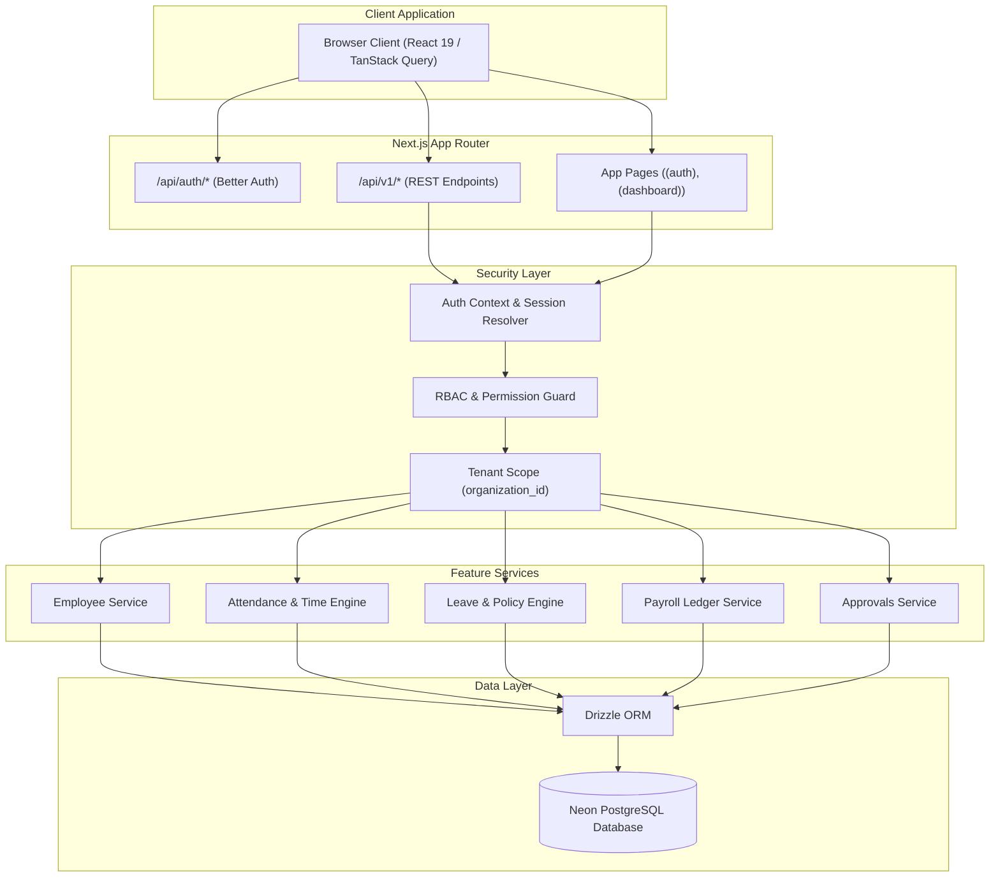

# Dayflow HRMS

> **Modern Human Resource Management System built with Next.js.**  
> *Every workday, perfectly aligned.*

[](https://nextjs.org/)
[](https://react.dev/)
[](https://www.typescriptlang.org/)
[](https://tailwindcss.com/)
[](https://neon.tech)
[](https://orm.drizzle.team)
[](https://better-auth.com)
[](https://bun.sh)
[](LICENSE)

---

## Overview

**Dayflow HRMS** is an enterprise-grade, modern Human Resource Management System designed to streamline workforce operations, attendance tracking, leave requests, payroll processing, multi-level approvals, and organizational analytics.

Built on the latest **Next.js App Router**, **React 19**, **Drizzle ORM**, **Neon PostgreSQL**, and **Better Auth**, Dayflow delivers a blazing-fast, secure, and intuitive experience for employees, managers, HR administrators, and system executives alike.

---

## Features

### 1. Authentication
- **Multi-Method Login**: Seamless sign-in via Email/Password credentials and GitHub OAuth 2.0 with PKCE support.
- **Session Security**: Secured via HTTP-only, `SameSite=Lax` cookies with cryptographic password hashing (Argon2/Scrypt).
- **Email Verification & Password Reset**: Automated token delivery with local console logging in development and transactional HTTPS provider support in production.
- **Brute-Force & Abuse Mitigation**: Built-in in-memory rate limiting and session rotation.

### 2. Role-Based Access Control (RBAC)
- **Four Distinct Workforce Tiers**:
  - `Admin`: Full organization settings, user role elevation, sensitive audit logs, and global configuration.
  - `HR`: Org-wide people management, attendance records, leave policies, payroll runs, and operational analytics.
  - `Manager`: Team dashboard, direct-report oversight, attendance correction reviews, and leave request decisions.
  - `Employee (User)`: Personal self-service portal (clock-in/out, leave requests, balance tracking, payslip downloads).
- **Zero Client Trust**: All mutations and data reads are enforced via server-authoritative role guards and tenant (`organization_id`) scoping.

### 3. Employee Management
- **Centralized Directory**: Comprehensive search, filtering, and pagination across all organizational staff.
- **Profile Lifecycle**: Full support for employee statuses (`onboarding`, `active`, `notice_period`, `inactive`) and employment types (`full_time`, `part_time`, `contract`, `intern`).
- **Reporting Hierarchy**: Dynamic manager-to-report assignment with direct cycle prevention.
- **Extended Records**: Embedded management of employee addresses, emergency contacts, and compliance documents.

### 4. Attendance Tracking
- **Real-Time Clock In / Clock Out**: 1-click self-service check-in with server-authoritative timestamps (anti-tamper protection).
- **Shift & Timezone Engine**: Automatic derivation of work dates, shifts, lateness, and overtime from employee work schedules and IANA timezone strings.
- **Duration & Break Calculation**: Automatic calculation of work hours, half-day/present statuses, and break intervals.
- **Attendance Corrections**: Multi-step workflow allowing employees to request time corrections with manager/HR review queues.

### 5. Leave & Time-Off Management
- **Custom Leave Types**: Configurable leave policies (Casual, Sick, Earned, Parental, Unpaid) with paid/unpaid rules.
- **Annual Allocations & Ledger**: Real-time balance tracking with atomic deduction upon request approval.
- **Smart Duration Calculation**: Automatic exclusion of company holidays and non-working weekend days from requested durations.
- **Request Lifecycle**: Status tracking across `pending`, `approved`, `rejected`, and `cancelled` states with mandatory rejection rationale.

### 6. Payroll Processing
- **Payroll Periods Workflow**: Multi-stage state machine (`draft` → `review` → `finalized` → `published`).
- **Exact-Cent Arithmetic**: High-precision numeric financial calculations for basic salary, gross earnings, itemized deductions, and net pay.
- **Employee Payslips**: Role-scoped employee self-service view and PDF/printable payslips.
- **Salary Catalog**: Scaffolding for modular salary structures and salary component rules.

### 7. Approvals
- **Unified Approvals Queue**: Dedicated dashboards for Managers and HR to review pending employee actions.
- **Dual Decision Channels**: Review, approve, or reject attendance corrections and leave applications with inline notes.
- **Event-Driven Side Effects**: Approvals automatically trigger balance adjustments, attendance updates, employee notifications, and immutable audit logs.

### 8. Analytics & Reporting
- **Interactive Dashboards**: Real-time workforce metrics, departmental headcount, attendance rates, and leave volume.
- **Visual Charts**: Powered by [Recharts](https://recharts.org) for monthly attendance breakdowns, leave utilization, and payroll disbursements.
- **Audit Trails**: Immutable `activity_logs` table tracking critical administrative actions and state modifications.

---

## Documentation

Explore the comprehensive documentation suite to understand every layer of Dayflow HRMS:

### 📜 Core Documentation
| Document | Purpose & Scope |
| :--- | :--- |
| 📖 [**Installation Guide**](./docs/INSTALLATION.md) | Step-by-step local setup, Docker PostgreSQL, Neon, environment variables, seeding, and production deployment. |
| 🏗️ [**Architecture & System Design**](./docs/ARCHITECTURE.md) | High-level system architecture, App Router organization, Domain-Driven Feature Pattern, and data flow diagrams. |
| 🤝 [**Contributing Guide**](./CONTRIBUTING.md) | Developer workflow, branch strategies, Conventional Commits, coding standards, and pull request procedures. |
| 📋 [**Changelog**](./CHANGELOG.md) | Chronologically curated version history, feature additions, fixes, and release notes following Keep a Changelog. |

### 🛡️ Governance & Security
| Document | Purpose & Scope |
| :--- | :--- |
| 📜 [**Code of Conduct**](./CODE_OF_CONDUCT.md) | Community pledge, behavioral standards, and reporting guidelines based on Contributor Covenant v2.1. |
| 🛡️ [**Security Policy**](./SECURITY.md) | Vulnerability disclosure, auth security, CSRF protection, tenant isolation, rate limiting, and hardening checklist. |
| 💬 [**Help & Support**](./SUPPORT.md) | Community forums, GitHub Discussions, Discord channels, and troubleshooting assistance. |

### 🗺️ Management & Legal
| Document | Purpose & Scope |
| :--- | :--- |
| 🏛️ [**Project Governance**](./GOVERNANCE.md) | Leadership framework, maintainer responsibilities, consensus models, and RFC decision-making processes. |
| 🗺️ [**Product Roadmap**](./ROADMAP.md) | Upcoming quarterly milestones, mobile PWA, biometric hardware sync, and statutory payroll goals. |
| ⚖️ [**License (MIT)**](./LICENSE) | Official open-source MIT legal permissions and warranty terms. |

### ⚙️ Technical References
| Document | Purpose & Scope |
| :--- | :--- |
| 🔌 [**API Documentation**](./API_DOCUMENTATION.md) | Complete REST API endpoint reference (`/api/v1/*`), request/response schemas, error handling, and auth contracts. |
| 🗄️ [**Database Design & Schema**](./DATABASE_SCHEMA.md) | Drizzle ORM entity definitions, 30 PostgreSQL tables, relational foreign keys, indexes, and migration guidelines. |
| 🧪 [**Testing Guide**](./TESTING.md) | Automated testing workflows, test suites, and manual verification procedures. |
| 🔐 [**Production Auth Runbook**](./docs/AUTH_PRODUCTION.md) | Production checklist for OAuth credentials, trusted origins, proxy headers, and session secrets. |

---

## Tech Stack

```text
Frontend Framework:     Next.js 16.3 (App Router) & React 19
Language:               TypeScript 5 (Strict Mode)
Styling & UI Primitives: Tailwind CSS v4, Base UI, Lucide Icons, Framer Motion
Data Fetching & State:  TanStack React Query v5 & React Table v9
Authentication:         Better Auth 1.7 (Credentials + GitHub OAuth)
Database & ORM:         PostgreSQL (Neon Serverless) & Drizzle ORM v1.0
Validation:             Zod v4
Charts & Visuals:       Recharts 3.8
Package Manager & Test: Bun 1.3
```

---

## System Architecture



---

## Role-Based Access Control (RBAC) Matrix

| Feature / Capability | Employee (`user`) | Manager (`user` + Mgr) | HR Administrator (`hr`) | System Admin (`admin`) |
| :--- | :---: | :---: | :---: | :---: |
| **Self Profile & Attendance** | :white_check_mark: | :white_check_mark: | :white_check_mark: | :white_check_mark: |
| **Self Leave Requests & Balance** | :white_check_mark: | :white_check_mark: | :white_check_mark: | :white_check_mark: |
| **Self Payslip Access** | :white_check_mark: | :white_check_mark: | :white_check_mark: | :white_check_mark: |
| **Direct Reports Team View** | :x: | :white_check_mark: | :white_check_mark: | :white_check_mark: |
| **Approve Team Attendance & Leave** | :x: | :white_check_mark: | :white_check_mark: | :white_check_mark: |
| **Organization Employee Directory** | :x: | :x: | :white_check_mark: | :white_check_mark: |
| **Create & Update Employees** | :x: | :x: | :white_check_mark: | :white_check_mark: |
| **Manage Organization Leave Policies** | :x: | :x: | :white_check_mark: | :white_check_mark: |
| **Execute & Finalize Payroll Runs** | :x: | :x: | :white_check_mark: | :white_check_mark: |
| **Assign Roles & Manage Admin Settings** | :x: | :x: | :x: | :white_check_mark: |
| **System Audit Logs & Security** | :x: | :x: | :x: | :white_check_mark: |

---

## Quick Start

### 1. Clone & Install
```bash
git clone https://github.com/your-org/dayflow.git
cd dayflow
bun install
```

### 2. Configure Environment
```bash
cp .env.example .env
```
Fill in your `DATABASE_URL`, `BETTER_AUTH_SECRET`, and GitHub OAuth credentials. *(See [Installation Guide](./docs/INSTALLATION.md) for full variable details).*

### 3. Migrate & Seed Database
```bash
bun run db:migrate
bun run db:seed
```

### 4. Run Development Server
```bash
bun run dev
```
Open [http://localhost:3000](http://localhost:3000) in your browser.

---

## Default Seed Credentials

All seeded accounts share the password: **`Password123!`**

| Role | Email | Employee ID | Purpose |
| :--- | :--- | :--- | :--- |
| **Admin** | `admin@dayflow.dev` | `EMP-1001` | Executive & System Administration |
| **HR Specialist** | `hr1@dayflow.dev` | `EMP-1002` | People, Leave, Attendance, & Payroll Management |
| **Team Manager** | `manager1@dayflow.dev` | `EMP-1004` | Engineering Team Oversight & Approvals |
| **Staff Employee** | `emp1@dayflow.dev` | `EMP-1006` | Employee Self-Service Operations |

*(Refer to [Installation Guide](./docs/INSTALLATION.md) for the complete list of 26 seeded accounts).*

---

## Project Structure

```text
dayflow/
├── docs/                   # System design, installation, and auth runbooks
├── drizzle/                # SQL migration files and snapshots
├── src/
│   ├── app/                # Next.js App Router (pages & API routes)
│   │   ├── (auth)/         # Sign-in, sign-up, email verification
│   │   ├── (dashboard)/    # Authenticated HRMS workspace
│   │   └── api/            # Better Auth & /api/v1 REST endpoints
│   ├── components/         # Shared UI primitives (Base UI, Tailwind)
│   ├── db/                 # Drizzle client, schemas (30 tables), and seeders
│   ├── features/           # Domain-driven modules (Attendance, Leave, Payroll, etc.)
│   ├── hooks/              # TanStack Query custom hooks
│   ├── lib/                # Auth, permissions, email, and API utilities
│   └── providers/          # Theme, Query, and Toast context providers
├── drizzle.config.ts       # Drizzle ORM configuration
├── package.json            # Scripts & project dependencies
└── tsconfig.json           # TypeScript strict configuration
```

---

## Verification & Quality Gates

Run the automated quality checks locally:

```bash
# Code Style & Linting
bun run lint

# TypeScript Strict Compilation Check
bun run typecheck

# Unit & Integration Tests
bun test

# Production Build Verification
bun run build
```

---

## License

This project is licensed under the [MIT License](LICENSE).
