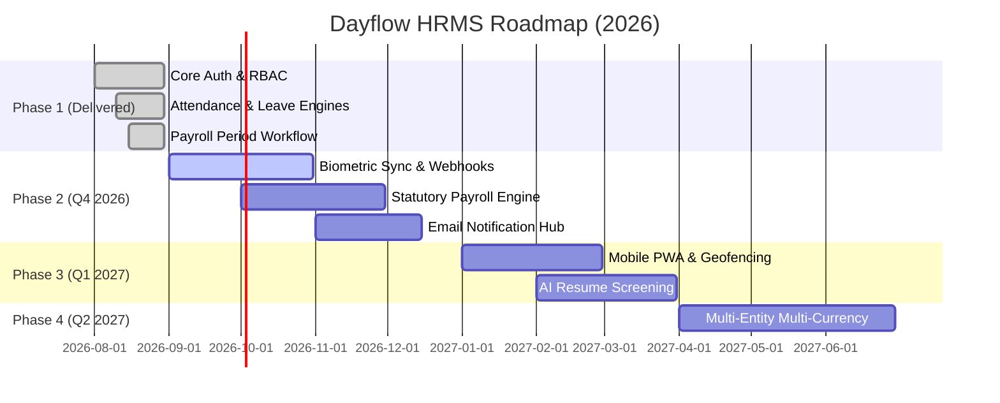

# Product Roadmap — Dayflow HRMS

This roadmap outlines the planned technical milestones, feature enhancements, and ecosystem expansions for **Dayflow HRMS**.

> [!NOTE]
> Dates and feature scopes are estimates and subject to prioritization based on community feedback and enterprise requirements.

---

## 🎯 Vision Statement

To be the most modern, developer-friendly, and extensible open-source Human Resource Management System for cloud-native organizations.

---

---

## 📅 Milestone Breakdown

### Phase 1: Core Foundation & HRMS Operations (Completed — v0.1.0)
- [x] **Next.js 16 App Router & React 19** architecture.
- [x] **Better Auth 1.7** integration with Email/Password and GitHub OAuth 2.0.
- [x] **Role-Based Access Control (RBAC)** across Admin, HR, Manager, and Employee tiers.
- [x] **Employee Directory & Lifecycle** (`active`, `onboarding`, `notice_period`, `inactive`).
- [x] **Attendance Engine** with server-authoritative timestamps, timezone shifts, and corrections.
- [x] **Leave Management** with custom policies, annual allocations, and smart holiday deduction.
- [x] **Payroll Period Workflow** (`draft` → `review` → `finalized` → `published`) and exact-cent net-pay arithmetic.
- [x] **Recharts Analytics Dashboard** and audit logging.

---

### Phase 2: Hardware Sync, Extensibility & Statutory Payroll (Q4 2026)

#### 1. Biometric Attendance Device Integration
- Direct MQTT and HTTP webhook listeners for biometric fingerprint and facial recognition scanners (ZKTeco, Hikvision).
- Automated raw punch sync to daily attendance log matching.

#### 2. Advanced Statutory Payroll Engine
- Localized tax, insurance, and statutory deduction formula engines (e.g. US W-2/1099, UK PAYE, India PF/ESI).
- Integration of `salary_structures`, `salary_components`, and `payslip_items` into dynamic payslip generation.
- Automated generation of Form 16 / tax calculation summaries.

#### 3. Enterprise Notification Webhooks & Slack / Discord Bots
- Real-time Slack, Microsoft Teams, and Discord notifications for leave requests, approvals, and clock-in reminders.
- Configurable webhooks for third-party HR and accounting integrations.

---

### Phase 3: Mobile PWA, Geofencing & AI Talent Suite (Q1 2027)

#### 1. Progressive Web App (PWA) & Geofencing
- Offline-first clock-in capability with background sync.
- Office location geofencing with GPS proximity validation for field employees.

#### 2. AI-Powered Talent & Recruitment Module
- Applicant Tracking System (ATS) with job posting portals.
- AI-driven resume parsing, automated candidate skill scoring, and interview scheduling workflows.

#### 3. Performance Appraisals & Goal Tracking (OKRs)
- 360-degree performance review cycles.
- Employee OKR and KPI goal-setting dashboards with manager appraisal milestones.

---

### Phase 4: Multi-Entity Enterprise & Direct Banking (Q2 2027)

#### 1. Multi-Entity & Multi-Currency Architecture
- Support for conglomerate parent-child multi-company tenancy under a single deployment.
- Multi-currency payroll disbursements with real-time FX exchange conversion.

#### 2. Direct Bank Payroll Payouts
- Automated ACH (US), SEPA (EU), and NEFT/RTGS (India) batch file generation and direct banking API integrations (Stripe Treasury, RazorpayX).

---

## 💡 Propose a Roadmap Item

Have a feature proposal or enterprise requirement?
- Submit a detailed proposal in our [GitHub Discussions (Ideas & RFCs)](https://github.com/uvpatel/dayflow-hrms/discussions).
