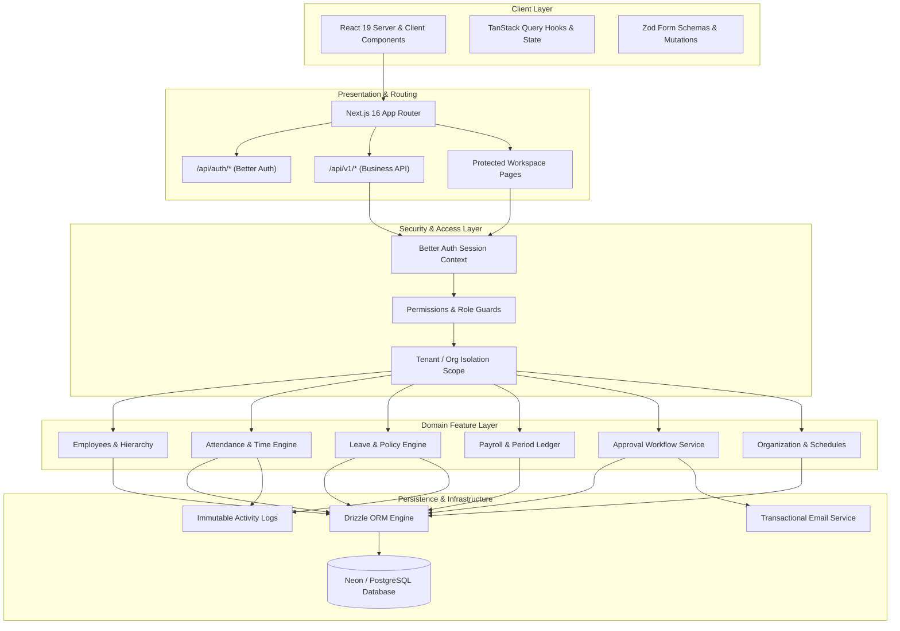
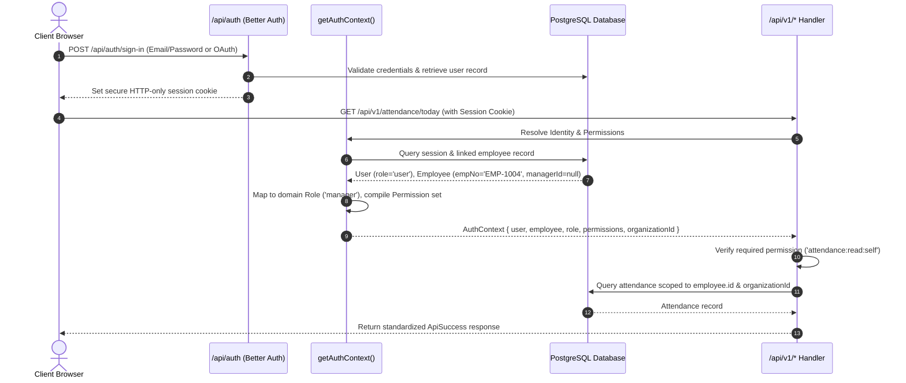

# Dayflow HRMS — Architecture & System Design

This document details the architectural principles, domain modeling, request lifecycles, authentication pipelines, and data access layers governing **Dayflow HRMS**.

---

## 1. High-Level Architecture

Dayflow is built as a modular monolithic web application leveraging the **Next.js App Router** with strict layered clean architecture. It enforces domain boundary isolation, server-authoritative mutations, and robust multi-tenancy controls.



---

## 2. Directory & Codebase Structure

The codebase is organized into domain-driven feature packages located in `src/features/`, core shared libraries in `src/lib/`, database schema definitions in `src/db/schema/`, and route trees in `src/app/`.

```text
dayflow/
├── docs/                       # Architectural specs & installation guides
│   ├── ARCHITECTURE.md         # System design & domain structure
│   ├── INSTALLATION.md         # Setup, migration, and deployment guide
│   └── AUTH_PRODUCTION.md     # Production auth configuration runbook
├── drizzle/                    # Generated SQL migrations and schema snapshots
├── public/                     # Static assets and media
├── src/
│   ├── app/                    # Next.js App Router root
│   │   ├── (auth)/             # Authentication views (sign-in, sign-up, verify-email)
│   │   ├── (dashboard)/        # Main protected application workspace
│   │   │   ├── admin/          # Admin-only workspace
│   │   │   ├── hr/             # HR operations hub
│   │   │   ├── attendance/     # Daily, weekly, corrections views
│   │   │   ├── time-off/       # Balance and leave requests
│   │   │   ├── payroll/        # Payroll periods & payslips
│   │   │   ├── approvals/      # Attendance & leave approval queues
│   │   │   ├── people/         # Organization employee directory
│   │   │   ├── my-team/        # Manager team dashboard
│   │   │   └── reports/        # Real-time workforce analytics
│   │   ├── api/
│   │   │   ├── auth/           # Better Auth endpoints ([...all]/route.ts)
│   │   │   └── v1/             # RESTful API route handlers
│   │   └── layout.tsx          # Root HTML layout with query/theme providers
│   ├── components/             # Reusable UI primitives & layout elements
│   │   ├── ui/                 # Base UI / Tailwind component library
│   │   └── layout/             # Sidebar, Header, User Nav
│   ├── db/                     # Database client & schema definitions
│   │   ├── schema/             # Drizzle table schemas (30 tables)
│   │   ├── seed/               # Idempotent database seeder
│   │   └── index.ts            # Neon/Postgres connection pooling client
│   ├── features/               # Domain modules (Feature-Sliced Design)
│   │   ├── employees/          # Employee profiles, hierarchy, docs
│   │   ├── attendance/         # Check-in/out engine, timezone derivation
│   │   ├── time-off/           # Leave requests, policy calculation, balances
│   │   ├── payroll/            # Payroll calculation & period workflow
│   │   ├── approvals/          # Generic & domain approval processors
│   │   └── organization/       # Departments, designations, locations
│   ├── hooks/                  # TanStack Query custom hooks & key factories
│   │   ├── use-attendance.ts
│   │   ├── use-leave.ts
│   │   ├── use-payroll.ts
│   │   └── use-employees.ts
│   ├── lib/                    # Shared utilities, security, and auth
│   │   ├── auth.ts             # Better Auth server configuration
│   │   ├── auth-client.ts      # Better Auth browser client
│   │   ├── auth-context.ts     # User/employee/tenant session resolver
│   │   ├── permissions.ts      # RBAC definitions & permission matrix
│   │   └── api-response.ts     # Standardized JSON response formatting
│   └── providers/              # React Query, Theme, and Tooltip providers
├── package.json
├── tsconfig.json
└── drizzle.config.ts
```

---

## 3. Domain-Driven Feature Pattern

Every domain module under `src/features/<domain>` follows a strict internal stratification:

```text
src/features/<domain>/
├── schemas.ts        # Zod validation schemas for forms and API requests
├── types.ts          # TypeScript domain interfaces and Drizzle inferred models
├── repository.ts     # Database queries and persistence abstractions (Drizzle ORM)
├── service.ts        # Pure business logic, validations, state transitions
├── actions.ts        # Server Actions interfacing UI with domain services
└── components/       # Domain-specific React components (forms, tables, cards)
```

### Separation of Concerns:
1. **Schemas (`schemas.ts`)**: Defines runtime input validation via Zod, guaranteeing sanitization before reaching services.
2. **Repositories (`repository.ts`)**: Direct database access using Drizzle ORM. Strictly handles SQL operations, filtering by `organization_id` and indexing keys.
3. **Services (`service.ts`)**: Coordinates business transactions, state machine transitions, audit logging, and email triggers. Never allows invalid state mutations.
4. **Server Actions / API Handlers**: Authenticates current session via `getAuthContext()`, verifies RBAC permissions, and delegates directly to Domain Services.

---

## 4. Authentication & Identity Pipeline

Dayflow integrates **Better Auth** with a custom identity bridge to link authenticated web users with internal HRMS workforce employee profiles.



### Identity Resolution Contract (`AuthContext`)
The resolved `AuthContext` object provides:
- **`user`**: Better Auth core user object (id, email, emailVerified).
- **`employee`**: Linked employee record (id, organizationId, employeeNumber, departmentId, managerId).
- **`role`**: Normalized application role (`admin`, `hr`, `manager`, `employee`).
- **`permissions`**: Set of granted permission strings.
- **`organizationId`**: Tenant ID for strict multi-tenant isolation.

---

## 5. Core Domain Engines

### A. Attendance Engine
- **Server-Authoritative Clock**: Check-in and check-out timestamps are recorded exclusively using server system time (`new Date()`). Client-supplied timestamps are ignored.
- **Timezone Derivation**: Shifts and work dates are derived from the organization's or employee's IANA timezone setting (e.g. `America/Los_Angeles`).
- **Lateness & Overtime**: Calculated automatically against the assigned `work_schedule` and `work_schedule_days`.
- **Atomic State Transitions**: An employee cannot have more than one open check-in session at any time.

### B. Leave & Time-Off Engine
- **Atomic Balance Deductions**: When a leave request is submitted, allocations are verified against policy constraints. Approval atomically locks allocated days and prevents overlapping requests.
- **Workday & Holiday Filtering**: Non-working days and organization holidays are automatically excluded from leave duration calculation.

### C. Payroll & Ledger Engine
- **Period Lifecycle**: Periods follow a strict finite-state transition:
  $$\text{Draft} \longrightarrow \text{Review} \longrightarrow \text{Finalized} \longrightarrow \text{Published}$$
- **Exact-Cent Arithmetic**: Financial calculations (gross earnings, deductions, net pay) avoid floating-point errors by maintaining exact numeric precision before updating `payslips`.

---

## 6. Database & Persistence Layer

- **ORM**: Drizzle ORM provides type-safe SQL queries with zero runtime overhead.
- **Connection Pooling**: Uses `@neondatabase/serverless` with WebSocket/HTTP pooling for efficient serverless execution.
- **Transactions**: Multi-table operations (e.g., leave approval creating attendance adjustments, balance updates, and audit records) are wrapped in `db.transaction()` blocks to ensure consistency.

---

## 7. Client State & UI Hydration

- **Server Components (RSC)**: Initial layout data, user context, and static catalogs render server-side for maximum performance.
- **TanStack React Query v5**: Handles asynchronous client-side data fetching, cache invalidation, and polling.
- **Optimistic UI Updates**: Used in interactive views (such as clocking in/out or quick approvals) to deliver instant visual feedback while awaiting server confirmation.
- **Styling**: Tailwind CSS v4 with Base UI primitives ensuring responsive and accessible design.
