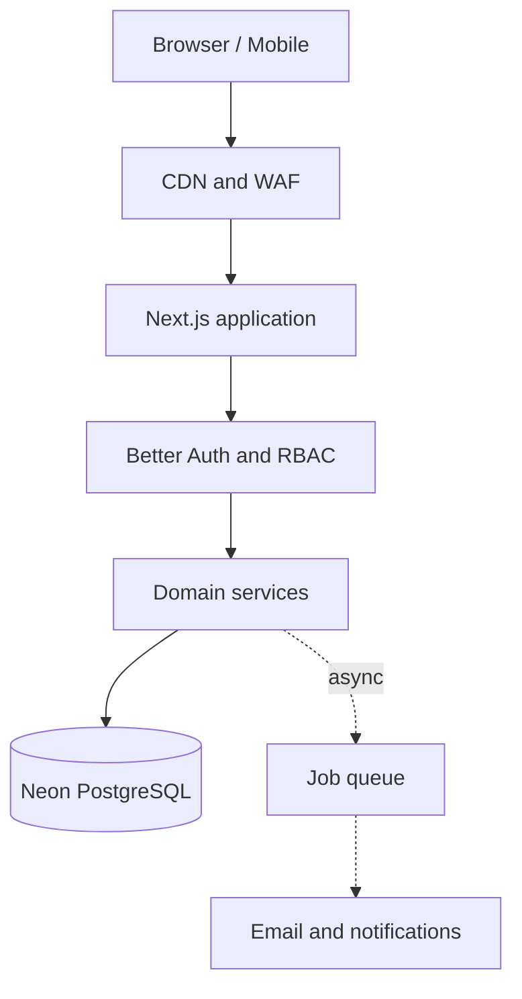

# Dayflow HRMS — Production System Design

This guide turns Dayflow's existing modular monolith into a production-ready system while preserving simple deployments and transactional correctness.

## 1. Architecture decision

Keep Dayflow as a **modular monolith** until measured load or team ownership requires a split. Payroll, leave balances, approvals, and attendance have tightly related transactions; prematurely separating them would add distributed transactions and operational cost.

The synchronous path owns validation, authorization, tenant isolation, and database commits. Slow or retryable side effects—email, exports, notification fan-out, and large payroll calculations—belong on an asynchronous job path in a later phase.

## 2. Current request path

1. The browser calls a versioned `/api/v1/*` route.
2. The route resolves the Better Auth session and employee identity.
3. Server-side RBAC checks the requested capability.
4. Every repository query is scoped by `organizationId`.
5. A domain service validates the state transition.
6. Drizzle commits the transaction to PostgreSQL.
7. The route returns the shared API response contract.

Client-side role checks are navigation conveniences only; they are never authorization boundaries.

## 3. Reliability endpoints implemented

| Endpoint | Purpose | Dependency check | Failure status |
| --- | --- | --- | --- |
| `GET /api/health/live` | Confirms the Next.js process can answer requests | None | Process/platform failure |
| `GET /api/health/ready` | Confirms the instance can serve database-backed traffic | PostgreSQL `SELECT 1`, 3-second timeout | `503` |
| `GET /api/health/auth` | Deep auth configuration and schema diagnostics | Auth config and auth schema | `503` |

Use `live` for platform liveness, `ready` for deployment readiness, and the deeper auth check for controlled diagnostics. None of these routes returns credentials or database details.

## 4. Data and consistency model

- PostgreSQL remains the source of truth for identities, employees, attendance, leave, payroll, approvals, and audit records.
- Use database transactions for state changes that affect balances or ledgers.
- Add unique constraints for business invariants such as one attendance record per employee/workday and one payslip per employee/period.
- Require idempotency keys before retrying payroll finalization, bulk imports, or payment-like operations.
- Prefer cursor pagination for activity logs and large employee histories; offset pagination is acceptable for small administrative catalogs.
- Never cache permission decisions or employee-sensitive records in a shared public cache.

## 5. Scaling plan

### Phase 1 — current to roughly 10,000 employees

- Deploy stateless Next.js instances.
- Keep Neon as the single transactional database.
- Add the CI quality gate and health probes from this change.
- Measure route latency, database latency, error rate, and slow queries.
- Review query plans and add indexes based on production evidence.

### Phase 2 — background work and hot reads

- Add a durable queue for email, notification fan-out, exports, and payroll batches.
- Use an outbox table written in the same transaction as business state, then publish jobs from the outbox.
- Add Redis only for measured needs such as distributed rate limits, short-lived locks, or explicitly safe cached catalogs.
- Store generated payslips and employee documents in private object storage using short-lived signed URLs; keep metadata in PostgreSQL.

### Phase 3 — high scale or independent teams

- Add read replicas for reporting workloads.
- Move analytics to a warehouse or replicated reporting store.
- Extract a domain only when it has independent ownership, scaling, and release needs. Notifications and reporting are safer first candidates than payroll or leave.

## 6. Security boundaries

- Authenticate once, authorize every server operation, and scope every query to the organization.
- Do not accept `organizationId`, role, employee ID, timestamps, or payroll totals from the client as authoritative values.
- Apply distributed rate limiting to sign-in, password reset, check-in/out, exports, and bulk mutations before horizontal scaling.
- Encrypt traffic in transit, use provider-managed encryption at rest, rotate secrets, and avoid logging cookies, tokens, salary values, or personal documents.
- Preserve append-only audit events for privileged operations and include actor, tenant, action, target, timestamp, and request correlation ID.

## 7. Observability and service objectives

Start with these service-level objectives and revise them from real traffic:

| Signal | Initial objective |
| --- | --- |
| Availability | 99.9% monthly for authenticated API traffic |
| API latency | p95 under 500 ms for normal reads and writes |
| Error rate | Under 1% non-user-caused 5xx responses |
| Database readiness | p95 probe latency under 250 ms |
| Recovery point objective | 15 minutes or better |
| Recovery time objective | 60 minutes or better |

Emit structured JSON logs with request ID, route, method, status, duration, deployment, and tenant ID where permitted. Alert on sustained readiness failures, rising 5xx rate, database saturation, and queue age.

## 8. Deployment checklist

1. Run lint, type checking, tests, and a production build.
2. Apply backward-compatible database migrations before new code depends on them.
3. Deploy to preview and verify `/api/health/live`, `/api/health/ready`, and `/api/health/auth`.
4. Run authentication, tenant-isolation, attendance, leave approval, and payroll smoke tests.
5. Promote gradually, watch error and latency dashboards, and retain a rollback target.

## 9. Next implementation backlog

1. Add request correlation and structured logging around every API route.
2. Add integration tests for cross-tenant access denial and concurrent attendance/leave mutations.
3. Add idempotency storage for payroll calculation/finalization.
4. Add an outbox worker for email and notifications.
5. Add private object storage for documents and generated payslips.
6. Add tracing and slow-query instrumentation before introducing caches or services.
